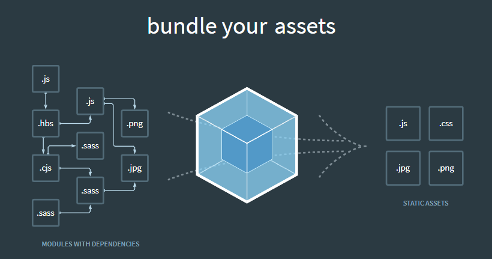

### 01\_리액트 시작하기

#### 01-1 리액트의 정체를 알아보자!

- 어떤 프레임워크를 공부해야 할까?
- 리액트의 개념과 장점은 무엇일까?
  - 컴포넌트 기반으로 화면 구성
  - 게임 엔진 원리 도입
    - [Virtual DOM](https://reactjs.org/docs/faq-internals.html#what-is-the-virtual-dom)
    - [virtual dom vs incremental dom](https://auth0.com/blog/face-off-virtual-dom-vs-incremental-dom-vs-glimmer/)
- 노드 패키지 매니저란 무엇일까?
  - 자바스크립트 라이브러리 관리
  - package.json에 정의됨
  - npm, yarn
- 웹팩이란 무엇일까?
  - 

#### 01-2 리액트 개발 환경 설치하기

- 개발 환경 구축
  - nvm 설치
  - node 10.10.0 버전 설치
    - npm 6.4.1 설치됨
  - yarn 설치
    - npm install -g yarn
  - create-react-app 설치
    - yarn global add create-react-app
- 프로젝트 생성
  - npx create-react-app {project name}
  - pacakge.json 업데이트
    - https://github.com/justinpark/justin-do-it-react/blob/master/package.json
  - babel-loader 호환성 오류 해결
    - `.env` 파일 설정
    - `SKIP_PREFLIGHT_CHECK = true`
  - yarn 실행
    - `yarn.ps1 파일을 로드할 수 없습니다.` 에러 발생
    - 파워쉘의 권한 설정 변경(RemoteSigned 설정)
      ```
      $ Set-ExecutionPolicy -Scope CurrentUser
          ExecutionPolicy: RemoteSigned
      ```
  - 패키지 다운로드
    - yarn
- 비주얼 스튜디오 플러그인 설치
  - Reactjs code snippets
    - 리액트 템플릿 생성 도구
    - jsx??
      - [공식 홈페이지에서 확인](https://reactjs.org/)
    - RCC -기본 리액트 컴포넌트 코드 생성
    - RCCP
      - 리액트 컴포넌트를 프로퍼티 타입과 함께 생성
    - RCFC
      - 리액트 컴포넌트를 생명주기 함수와 함께 생성
    - RPC
      - 리액트 퓨어 컴포넌트 생성
    - RSC
      - 함수형 컴포넌트 생성
    - RSCP
      - 함수형 컴포넌트를 프로퍼티 타입과 함께 생성
  - Prettier
    - 코드 스타일 자동 변환 도구
    - .prettierrc 설정
      ```
      {
          "useTabs": false,
          "printWidth": 100,
          "tabWidth": 2,
          "trailingComma": "all",
          "semi": true,
          "singleQuote": true
      }
      ```
    - 적용하기
      - 명령 팔레트(ctrl+shift+p)에서 `Format Document` 선택
    - 자동 설정
      - [Preferences > Settings] 선택
      - formatOnSave 입력
      - `Format On Save` 설정 체크

#### 01-3 리액트 앱 수정하기

- [소스 참조](../../src/ch01/App.js)
