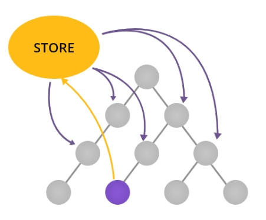

### 07\_리덕스로 데이터 관리하기

#### 07-1 리덕스의 기초 알아보기

- 스토어를 중심으로 리덕스 개념 알아보기
  - 
- 리덕스와 컨테스트 중 무엇을 사용해야 할까?
  - 프로퍼티
    - 상위 컴포넌트에서 하위 컴포넌트로 전달되는 읽기 전용 데이터
  - state
    - 컴포넌트의 상태를 저장하고 변경할 수 있는 데이터
  - 컨텍스트
    - 부모 컴포넌트에서 생성하여 모든 자식 컴포넌트에 전달하는 데이터
  - 리덕스
    - 서버에서 받은 데이터를 앱 전체에 전달하거나 관리
- 리덕스는 어떻게 동작할까?
  
  - 컴포넌트는 손님
  - dispatch(), connect() 함수는 종업원
  - 액션은 주문서
  - 리듀서는 요리사
- 리덕스 개발 준비하기
  - 리덕스 설치하기
    ```
    yarn add redux react-redux
    ```
  - 리덕스 크롬 확장 도구 설치하기
  - 크롬의 개발자 도구 확인
  - 리덕스 개발자 도구 설치하기
    ```
    yarn add redux-devtools-extension --dev
    ```
- 리덕스로 빈 스토어 생성해 보기

  - 스토어 생성하기
    ```
    createStore(reducer, /* initial state */, /* enhancer */)
    ```
    - [소스](../../src/ch07/ReduxApp01.jsx)
    ```
    class ReduxApp extends PureComponent {
      store = createStore(
        (state) => state,
      );
      render() {
        return <provider store={this.store}>리덕스 예제</provider>;
      }
    }
    ```
  - 리덕스 크롬 확장 도구 확인하기
  - 리덕스 개발자 도구 연동하기
    ```
    class ReduxApp extends PureComponent {
      store = createStore(
        (state) => state,
        window.__REDUX_DEVTOOLS_EXTENSION__ && window.__REDUX_DEVTOOLS_EXTENSION__(),
      );
      render() {
        return <provider store={this.store}>리덕스 예제</provider>;
      }
    }
    ```
  - 스토어 데이터 확인해 보기

- 리덕스로 채워진 스토어 생성해 보기

  - 스토어에 스토어 데이터 설정해 보기

    ```
    class ReduxApp extends PureComponent {
      store = createStore(
        (state) => state,
        { loading: false, name: '두잇 리액트 스터디' },
        window.__REDUX_DEVTOOLS_EXTENSION__ && window.__REDUX_DEVTOOLS_EXTENSION__(),
      );

      render() {
        return <provider store={this.store}>리덕스 예제</provider>;
      }
    }
    ```

#### 07-2 액션과 리듀서의 관계 알아보기

- 액션 알아보기
  - { type: ..., payload: ... } 구조로 된 객체
    - type
      - 액션이 어떤 작업인지에 대한 고유값
      - type 키워드 변경 불가
    - payload
      - 스토어에서 사용될 값
      - payload 키워드 변경 가능
      - 생략 가능
  ```
  {
    type: 'SET_LOADING',
    payload: true,
  }
  {
    type: 'SET_USER',
    payload: { name: 'Park', age: 20 }
  }
  {
    type: 'RESET_LOADING'
  }
  ```
- 리듀서 알아보기
  ```
  function reducer(state, action) { return state; }
  const reducer = (state, action) => state + action.payload;
  ```
  - 리듀서가 반환하는 값의 자료형은 스토어의 이전 데이터와 동일해야 함
- dispatch() 함수 알아보기

  - 액션은 dispatch() 함수를 통해 리듀서로 전달
  - [소스](../../src/ch07/ReduxApp02.jsx)

  ```
  class ReduxApp extends PureComponent {
    store = createStore(
      (state) => state,
      { loading: false, name: '두잇 리액트 스터디' },
      window.__REDUX_DEVTOOLS_EXTENSION__ && window.__REDUX_DEVTOOLS_EXTENSION__(),
    );

    componentDidMount() {
      this.store.dispatch({
        type: 'SET_LOADING',
        payload: true,
      });
    }

    render() {
      return <provider store={this.store}>리덕스 예제</provider>;
    }
  }
  ```

- 리듀서 구현하고 실행해 보기

  - SET_LOADING 리듀서 구현하기

    - [소스](../../src/ch07/ReduxApp03.jsx)

    ```
    const reducer = (state, action) => {
      const { type, payload } = action;
      switch (type) {
        case 'SET_LOADING': {
          return {
            ...state,
            loading: payload,
          };
        }
        default:
          return state;
      }
    };

    class ReduxApp extends PureComponent {
      store = createStore(
        reducer,
        { loading: false, name: '두잇 리액트 스터디' },
        window.__REDUX_DEVTOOLS_EXTENSION__ && window.__REDUX_DEVTOOLS_EXTENSION__(),
      );

      componentDidMount() {
        this.store.dispatch({
          type: 'SET_LOADING',
          payload: true,
        });
      }

      render() {
        return <provider store={this.store}>리덕스 예제</provider>;
      }
    }
    ```

  - 리듀서 수정하기

    ```
    const reducer = (state, action) => {
      const { type, payload } = action;
      switch (type) {
        ...
        case 'RESET_LOADING': {
          return {
            ...state,
            loading: false,
          };
        }
        case 'SET_USER': {
          return {
            ...state,
            user: payload,
          };
        }
        ...
      }
    };

    class ReduxApp extends PureComponent {
      ...

      componentDidMount() {
        this.store.dispatch({
          type: 'SET_LOADING',
          payload: true,
        });
        this.store.dispatch({ type: 'RESET_LOADING' });
        this.store.dispatch({ type: 'SET_USER', payload: { name: 'Kim', age: 20 } });
      }
    }
    ```

  - 크롬 리덕스 확장 도구에서 추가 액션 항목 확인하기
  - 액션 목록 눌러보며 단게별 스토어 결과 확인하기

- 리듀서 분리하기

  - 데이터의 종류에 맞게 분리하여 코드를 효율적으로 관리
  - loading 관련 리듀서 분리하기

    ```
    export default function reducer(state, action) {
      const { type, payload } = action;
      switch (type) {
        case 'SET_LOADING': {
          return { ...state, loading: payload };
        }
        case 'RESET_LOADING': {
          return { ...state, loading: false };
        }
        default:
          return state;
      }
    }

    ```

  - user 관련 리듀서 분리하기

    ```
    export default function reducer(state = {}, action) {
      const { type, payload } = action;
      switch (type) {
        case 'SET_USER': {
          return { ...state, user: payload };
        }
        default:
          return state;
      }
    }

    ```

  - 리듀서 묶어주기

    ```
    import loading from './loadingReducer';
    import user from './userReducer';

    export default {
      loading,
      user,
    };
    ```

  - 스토어 설정 파일 만들기

    ```
    import { createStore, combineReducers } from 'redux';
    import { composeWithDevTools } from 'redux-devtools-extension';
    import reducers from './reducers';

    export default (initStates) =>
      createStore(combineReducers(reducers), initStates, composeWithDevTools());
    ```

  - 리액트 앱 다시 구성하기

    ```
    import React, { PureComponent } from 'react';
    import { createStore } from 'redux';
    import configureStore from './configureStore';

    class AdvReduxApp extends PureComponent {
      store = configureStore({ loading: false, name: '두잇 리액트 스터디' });
      ...
    ```

  - 분리된 리듀서 수정하기
    - 리듀서 state 초기값 설정
  - loading 리듀서 반환값 재구성하기
    ```
    const initState = false;
    export default function reducer(state = initState, action) {
      const { type, payload } = action;
      switch (type) {
        case 'SET_LOADING': {
          return payload;
          // return { ...state, loading: payload };
        }
        case 'RESET_LOADING': {
          return initState;
          // return { ...state, loading: false };
        }
        default:
          return state;
      }
    }
    ```
  - user 리듀서 반환값 재구성하기

- 액션 분리하기

  - loading 액션 분리하기

    ```
    export const SET_LOADING = 'loading/SET_LOADING';
    export const SET_RESET = 'loading/RESET_LOADING';

    export const setLoading = (loading) => ({
      type: SET_LOADING,
      payload: loading,
    });

    export const resetLoading = () => ({
      type: SET_RESET,
    });

    ```

  - 익스포트한 액션 타입을 리듀서에 적용하기

    ```
    import { SET_LOADING, RESET_LOADING } from '../actions/loadingActions';

    const initState = false;

    export default function reducer(state = initState, action) {
      const { type, payload } = action;
      switch (type) {
        case SET_LOADING: {
          return payload;
          // return { ...state, loading: payload };
        }
        case RESET_LOADING: {
          return initState;
          // return { ...state, loading: false };
        }
        default:
          return state;
      }
    }
    ```

  - 리액트 앱 수정하기

    ```
    import React, { PureComponent } from 'react';
    import { createStore } from 'redux';
    import configureStore from './configureStore';

    import { setLoading, resetLoading } from './actions/loadingActions';
    import { setUser } from './actions/userActions';

    class AdvReduxApp extends PureComponent {
      store = configureStore({ loading: false, name: '두잇 리액트 스터디' });

      componentDidMount() {
        this.store.dispatch(setLoading(true));
        this.store.dispatch(resetLoading());
        this.store.dispatch(setUser({ name: 'Kim', age: 20 }));
      }

      render() {
        return <provider store={this.store}>리덕스 예제</provider>;
      }
    }

    export default AdvReduxApp;
    ```

#### 07-3 그래프 데이터베이스 도입하기

- 그래프 데이터베이스를 소개합니다
  - 일반 DB는 사용 못 함
  - json 형태의 그래프 데이터베이스 사용
- 객체 배열 형태의 자료를 스토어에 저장하도록 앱 수정하기

  - 액션 추가하기
    ```
    export const SET_COLLECTION = 'collection/SET_COLLECTION';
    export const setCollection = (collections) => ({
      type: SET_COLLECTION,
      payload: collections,
    });
    ```
  - dispatch() 함수에서 액션 전달하고 앱 실행

    ```
    class AdvReduxApp extends PureComponent {
      store = configureStore({ loading: false, name: '두잇 리액트 스터디' });

      componentDidMount() {
        this.store.dispatch(
          setCollection([
            { id: 1, name: 'John', age: 30 },
            { id: 2, name: 'Smith', age: 10 },
          ]),
        );
      }

      ...
    }
    ```

  - 그래프 DB 구조 만들기

    ```
    const initState = {
      ids: [],
      entities: {},
    };

    export default (state = initState, action) => {
      const { type, payload } = action;

      switch (type) {
        default:
          return state;
      }
    };
    ```

  - reduce()를 함수로 객체 배열 자료를 객체 형태로 변환하기

    ```
    ...
    export default (state = initState, action) => {
      const { type, payload } = action;

      switch (type) {
        case SET_COLLECTION: {
          const ids = payload.map((entity) => entity['id']);
          const entities = payload.reduce(
            (finalEntities, entity) => ({
              ...finalEntities,
              [entity['id']]: entity,
            }),
            {},
          );
          return { ...state, ids, entities };
        }
      }
      ...
    }
    ```

  - index.js에 리듀서 추가하기
    ```
    ...
    export default {
      loading,
      user,
      collection,
    };
    ```
  - 리듀서 실행 확인하기
    - [스토리](../../src/stories/ReduxStory.jsx)

- 스토어에 저장된 데이터 읽어 들이기(그래프 DB 읽어 들이기)

  - 스토어 읽어 들이기

    ```
    ...
    componentDidMount() {
      this.store.dispatch(
        setCollection([
          { id: 1, name: 'John', age: 30 },
          { id: 2, name: 'Smith', age: 10 },
        ]),
      );

      const { collection } = this.store.getState();
      const { ids, entities } = collection;
      const originPayload = ids.map((id) => entities[id]);
      console.log(originPayload);
    }
    ...
    ```

- 그래프 DB 수정하기

  - 그래프 DB 수정에 대한 액션 추가하기
    ```
    ...
    export const SET_AGE = 'collection/SET_AGE';
    export const setAge = (id, age) => ({
      type: SET_AGE,
      payload: { id, age },
    });
    ```
  - 리듀서에 그래프 DB 자료 수정하는 코드 추가하기
    ```
    ...
    case SET_AGE: {
      const { id, age } = payload;
      return {
        ...state,
        entities: {
          ...state.entities,
          [id]: { ...state.entities[id], age },
        },
      };
    }
    ...
    ```
  - 리듀서 추가하고 그래프 DB 수정 확인해 보기

    ```
    ...
    componentDidMount() {
      this.store.dispatch(
        setCollection([
          { id: 1, name: 'John', age: 30 },
          { id: 2, name: 'Smith', age: 10 },
        ]),
      );

      this.store.dispatch(setAge(2, 55));

      const { collection } = this.store.getState();
      const { ids, entities } = collection;
      const originPayload = ids.map((id) => entities[id]);
      console.log(originPayload);
    }
    ...
    ```

#### 07-4 데이터를 위한 컴포넌트 알아보기

- 화면 컴포넌트와 데이터 컴포넌트 구분하기
  - 화면 컴포넌트
    - 컴포넌트를 화면에 출력하는데 집중
    - 프로퍼티를 통해 데이터를 전달하기만 함
    - 데이터의 변경은 프로퍼티로 전달받은 콜백 함수를 호출하거나 state를 사용
  - 데이터 컴포넌트
    - 스토어의 데이터를 컴포넌트에 전달하거나 변경하는데 집중
    - react-redux 공급자의 스토어를 연결하여 데이터 관리
    - 스토어의 리듀서와 dispatch() 함수를 화면 컴포넌트의 프로퍼티로 전달
    - react-redux의 공급자를 구독하는 소비자 컴포넌트 형태를 가짐
- 데이터 컴포넌트와 화면 컴포넌트 출력해 보기

  - 화면 컴포넌트 만들기

    ```
    ...
    class PresentationComponent extends PureComponent {
      render() {
        const { userName, entity } = this.props;
        return (
          <div>
            이름 : {userName}
            선택된 항목 : {entity && `name: ${entity.name}, age: ${entity.age}`}
          </div>
        );
      }
    }

    PresentationComponent.propTypes = {
      userName: PropTypes.string,
      entity: PropTypes.shape({
        id: PropTypes.number,
        name: PropTypes.string,
        age: PropTypes.number,
      }),
    };
    ...
    ```

  - connect() 함수로 데이터 컴포넌트 생성하기

    ```
    import { connect } from 'react-redux';
    import PresentationComponent from '../PresentationComponent';

    const mapStateToProps = (state, props) => {
      return {
        userName: state.user.name,
        entity: state.collection.entities[props.id],
      };
    };

    export default connect(mapStateToProps)(PresentationComponent);
    ```

  - 데이터 컴포넌트 출력하기
    - [화면,데이터 컴포넌트](../../src/stories/ReduxStory.jsx)

- 데이터 컴포넌트에 액션 연결하기

  - 화면 컴포넌트 작성하기

    ```
    import React, { PureComponent } from 'react';
    import PropTypes from 'prop-types';
    import Button from '../ch04/Button';

    class ActionComponent extends PureComponent {
      render() {
        const { setAge } = this.props;

        return (
          <>
            <Button onPress={() => setAge(2, 19)}>고유번호 2번 나이 19세로 변경</Button>
          </>
        );
      }
    }

    ActionComponent.propTypes = {
      setAge: PropTypes.func,
    };

    export default ActionComponent;

    ```

  - 데이터 컴포넌트 작성하기

    ```
    ...
    import { setAge } from '../actions/collectionActions01';

    const mapDispatchToProps = (dispatch) => {
      return {
        setAge: (id, age) => dispatch(setAge(id, age)),
      };
    };

    export default connect(null, mapDispatchToProps)(ActionComponent);
    ```

  - 액션 실행 확인하기
    ```
    <Provider store={this.store}>
        화면 컴포넌트: <PresentationComponent userName="화면 컴포넌트" />
        <br />
        데이터 컴포넌트: <ContainerComponent id={2} />
        <br />
        액션 데이터 컴포넌트: <DispatchContainer01 />
    </Provider>
    ```
    - [데이터 컴포넌트에 액션 연결](../../src/stories/ReduxStory.jsx)
  - mapDispatchToProp() 함수에서 dispatch 인자 생략하기

    ```
    ...
    import { setAge } from '../actions/collectionActions01';

    // const mapDispatchToProps = {setAge:setAge};
    const mapDispatchToProps = {setAge};

    export default connect(null, mapDispatchToProps)(ActionComponent);
    ```

  - 5개의 액션 추가하기
    ```
    ...
    <>
      <Button onPress={() => setLoading(true)}>setLoading</Button>
      <Button onPress={() => resetLoading()}>resetLoading</Button>
      <Button onPress={() => setCollection(collection)}>setCollection</Button>
      <Button onPress={() => setUser({ name: 'Park', age: 20 })}>setUser</Button>
      <Button onPress={() => setAge(2, 65)}>setAge</Button>
    ...
    </>
    ```
  - 액션 함수 컴포넌트에 연결하기
    ```
    const mapDispatchToProps = {
      setLoading,
      resetLoading,
      setUser,
      setCollection,
      setAge,
    };
    ```
  - 버튼을 눌러 동작 확인
    - [5개의 액션 연결](../../src/stories/ReduxStory.jsx)

#### 07-5 검색 기능 만들면서 리덕스 복습하기

- 검색을 위한 검색 입력 항목 저장하기

  - 액션 구성하기
    - [소스](../../src/ch07/actions/searchFilterActions.js)
  - 리듀서 구현하기
    - [filter 리듀서 소스](../../src/ch07/reducers/searchFilterReducer.js)
  - 리듀서를 스토어에 추가하기
    ```
    export default {
      loading,
      user,
      collection,
      searchFilter,
    };
    ```

- 검색창 만들기

  - 데이터 컴포넌트 만들기
    - [filter 컨테이너 소스](../../src/ch07/containers/SearchFilterInputContainer.jsx)
    - [리셋 컨테이너 소스](../../src/ch07/reducers/SearchResetButtonContainer.js)
  - 리덕스 앱에 검색창 추가하기

- 검색 결과 목록 만들기
  - 화면 컴포넌트 만들기
  - 데이터 컴포넌트 만들기
  - 리덕스 앱에 연동하기
